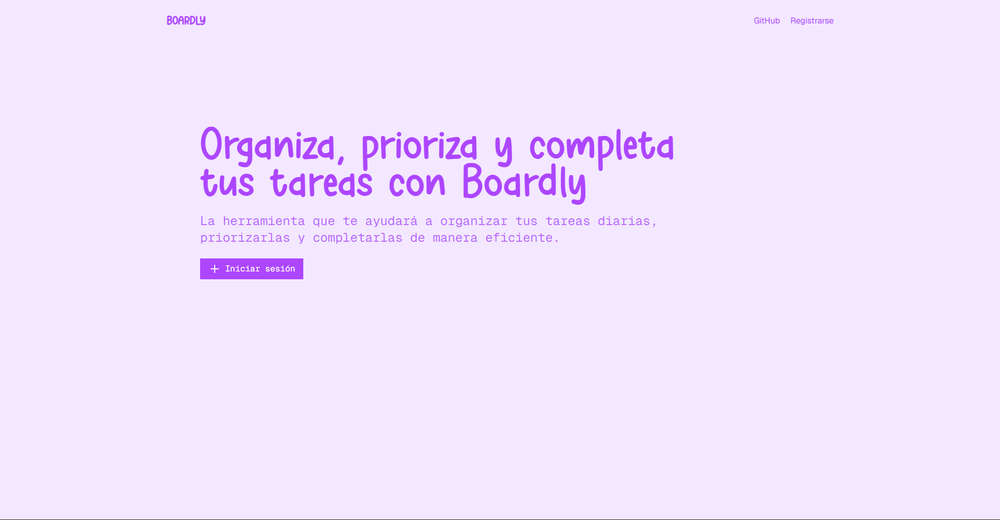
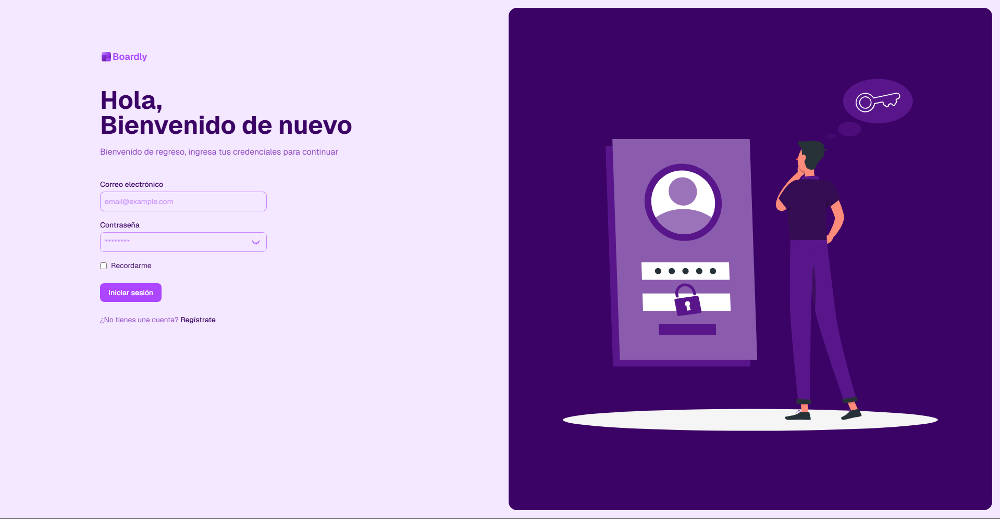
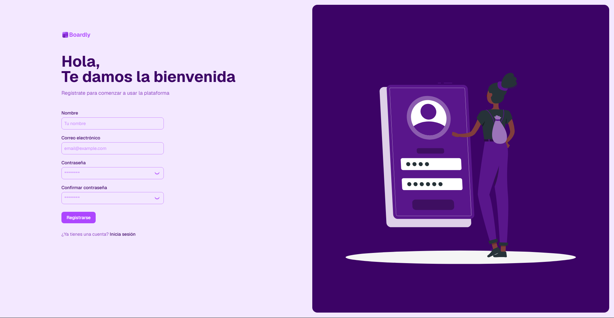
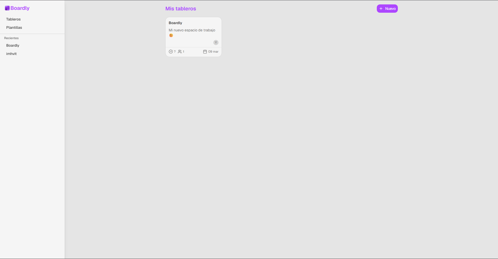
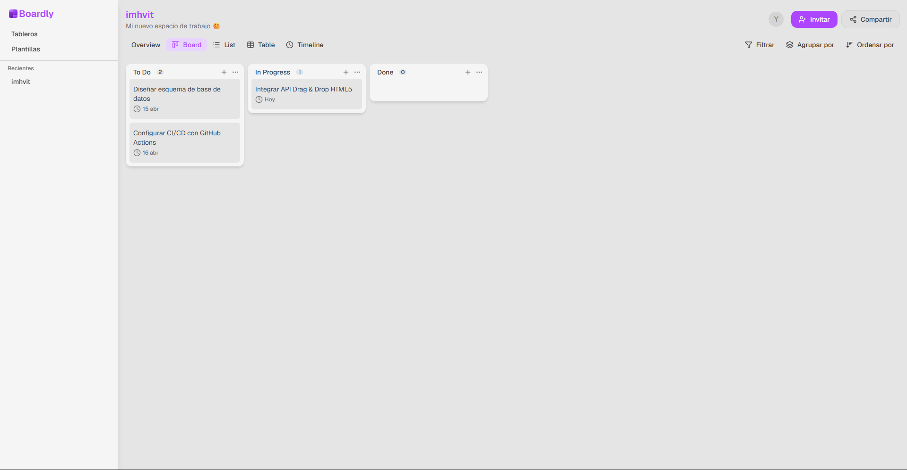

  

# Boardly

Tablero Kanban moderno, rápido y sin dependencias pesadas 🚀

## ⚙️ Stack

- **Backend:** Laravel 12
- **Frontend:** Vue 3 + Inertia.js
- **Estilos:** Tailwind CSS
- **DB:** MySQL

## 📸 Preview

### 🏠 Landing

### 🔐 Autenticación

### 📋 Boards

### 🧩 Tablero

